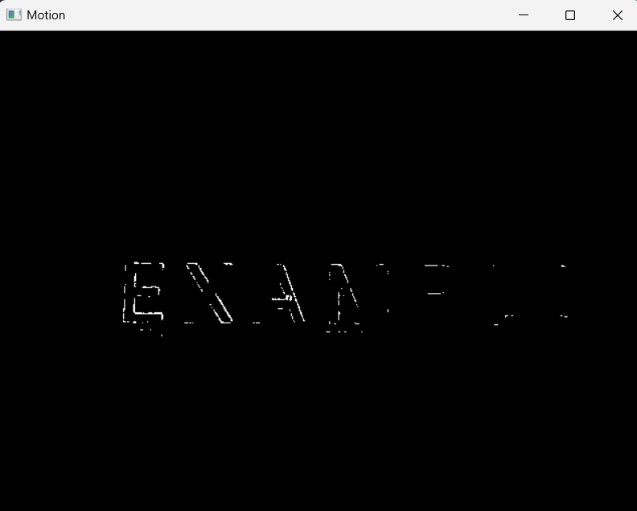

# Motion Detection and Edge Visualization with OpenCV

A real-time video processing application that combines motion detection and edge visualization using OpenCV. The program captures live video from a webcam, detects motion through frame differencing, and highlights edges using Sobel and Laplacian edge detection techniques.

## Features
- **Real-Time Motion Detection**: Detects areas of movement using frame differencing and binary thresholding.
- **Edge Detection**: Visualizes edges in the video using Sobel and Laplacian operators.
- **Combined Visualization**: Displays a merged view of motion and edge detection for enhanced analysis.

## How It Works
1. Captures video from your webcam.
2. Converts frames to grayscale for processing.
3. Detects motion by comparing the current frame with the previous frame.
4. Highlights edges using Sobel (horizontal and vertical gradients) and Laplacian operators.
5. Combines the motion and edge-detected frames into a single output.

## Installation
1. Clone the repository:
   ```bash
   git clone https://github.com/your-username/repo-name.git
   ```
2. Create a virtual environment:
    ```bash
    python -m venv .venv
    ```
    - Activate it
    ```bash
    .venv/Scripts/activate
    ```
    - Download Required Libraries
    ```bash
    pip install -r requirements.txt
    ```
    - Deactivate it
    ```bash
    deactivate
    ```
3. Run the Code:
    ```bash
    python motion_detection_edges.py
    ```
4. Press 'ESC' key to exit the application

## Outputs
- Original: Displays the live video feed.
- Motion: Binary image highlighting areas of motion.
- Sobel: Edge detection using Sobel operator.
- Combined: A merged visualization combining motion detection and edge-detected frames.

## Example


## Future Improvements
- video recording and saving option
- integration into an application
- edge detection in recorded videos

## Open to Contributions and Ideas